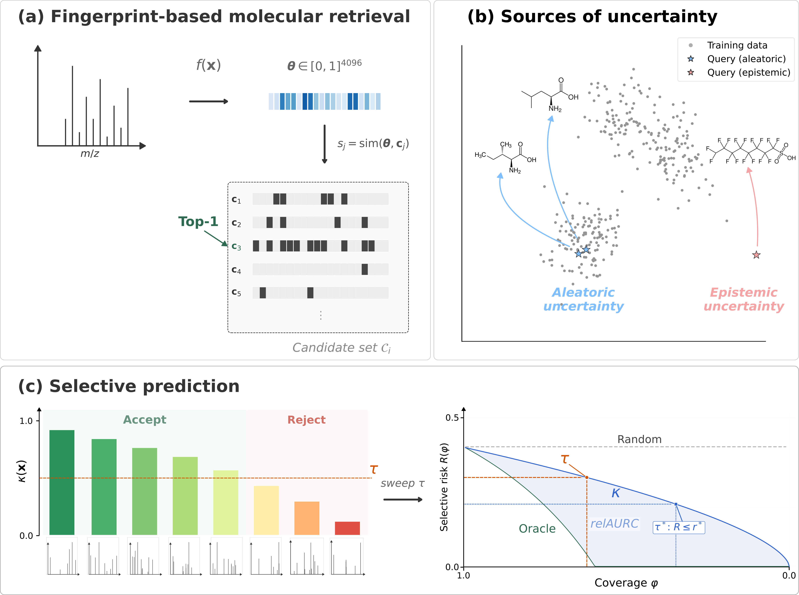

# Selective-MSMS
Code for **"When Should We Trust the Annotation? Selective Prediction for Molecular Structure Retrieval from Mass Spectra"**.

We introduce a selective prediction framework for molecular structure retrieval from tandem mass spectra (MS/MS), enabling models to abstain from predictions when uncertainty is too high.

All experiments are conducted on the [MassSpecGym](https://github.com/pluskal-lab/MassSpecGym) benchmark.

## Overview
<p align="center">
  
</p>

<p align="center">
  <em></em>
</p>

## Installation

```bash
conda create -n selective-msms python=3.11
conda activate selective-msms

# Install MassSpecGym library
pip install massspecgym

# Install this package
git clone https://github.com/BioML-UGent/selective-msms.git
pip install -e ./selective-msms/
```
## Data Preparation

This codebase uses a custom dataset (`RetrievalDataset_PrecompFPandInchi` from [ms-mole](https://github.com/gdewael/ms-mole)) that requires precomputed Morgan fingerprints and InChI keys alongside the MassSpecGym data. The following files are expected in a `helper_dir/` directory:

| File | Description |
|------|-------------|
| `MassSpecGym.tsv` | MassSpecGym dataset (auto-downloaded by the library) |
| `fp_4096.npy` | Precomputed 4096-bit Morgan fingerprints for all dataset molecules |
| `inchis.npy` | InChI keys for all dataset molecules |
| `MassSpecGym_retrieval_candidates_formula.json` | Retrieval candidate lists (grouped by molecular formula) |
| `MassSpecGym_retrieval_candidates_formula_fps.npz` | Precomputed fingerprints for all candidates |
| `MassSpecGym_retrieval_candidates_formula_inchi.npz` | InChI keys for all candidates |
| `ground_truth_bits_labels_test.pt` | Ground-truth fingerprints and labels for the test set |

The candidate lists and dataset TSV are provided by MassSpecGym. Fingerprint files must be precomputed from the SMILES strings using RDKit Morgan fingerprints (radius 2, 4096 bits), following the same procedure as [ms-mole](https://github.com/gdewael/ms-mole).


## Repository Structure

```
selective-msms/
├── ms_uq/                          
│   ├── core/                       
│   ├── models/                     
│   ├── inference/                  
│   ├── unc_measures/               # contains all uncertainty measures and decompositions
│   ├── evaluation/                 # contains functions for evaluating selective prediction performance
│   ├── utils/                      
│   ├── data.py                     
│   └── loss.py                     
├── scripts/                        
│   ├── train.py                    
│   ├── train_ensemble.py           # wrapper to train a second-order model: ensemble, mc_dropout, single
│   ├── make_predictions.py         # generate predictions for the test set
│   ├── run_evaluation.py           # evaluation script producing visual and analytical results
│   ├── run_sgr_evaluation.py       # evaluation script for risk control analysis
│   └── plot_sgr_analysis.py        
├── config/                         
│   └── sgr.yml                     # config for selective-risk-control analysis
    └── eval.yml                    # config for running risk-coverage analysis                   
└── tests/
```


## Pre-Trained Model Predictions

CURRENTLY UNDER CONSTRUCTION

We provide pre-computed predictions for the models used in the paper,
so that all evaluation results (Tables 2–4, Figures 2–5) can be
reproduced without training.

**Download**: [Zenodo DOI TODO](https://zenodo.org/TODO)

<!-- Alternative: [HuggingFace Hub](https://huggingface.co/datasets/BioML-UGent/selective-msms-predictions) -->

The archive contains one directory per model:

```
predictions/
├── ensemble_ranking/           # Deep Ensemble (S=5), ranking loss
│   ├── fp_probs.pt             #   (N, 5, 4096) bitwise probabilities
│   └── ranker.pt               #   learned biencoder scorer
├── ensemble_focal/             # Deep Ensemble (S=5), focal loss
│   └── fp_probs.pt
├── mcdo_ranking/               # MC Dropout (S=50), ranking loss
│   ├── fp_probs.pt
│   └── ranker.pt
├── mcdo_focal/                 # MC Dropout (S=50), focal loss
│   └── fp_probs.pt
├── laplace_ranking/            # Laplace (S=50), ranking loss
│   ├── fp_probs.pt
│   └── ranker.pt
├── laplace_focal/              # Laplace (S=50), focal loss
│   └── fp_probs.pt
└── ground_truth_bits_labels_test.pt   # shared ground truth
```

Each `fp_probs.pt` is a dict `{"stack": tensor(N, S, 4096), "meta": {...}}` containing
per-sample bitwise fingerprint probabilities from the test set.
Ranking-loss models additionally include a `ranker.pt` (learned biencoder similarity);
without it, scoring falls back to cosine similarity, which gives different (lower) performance for these models.

### Evaluate without training

After downloading and extracting the predictions to `outputs/predictions/`:

```bash
# 1. Prepare MassSpecGym data (see Data Preparation below)

# 2. Update paths in config/eval.yml to point to your data and predictions

# 3. Run evaluation (produces risk-coverage curves, AURC tables, plots)
python scripts/run_evaluation.py --config config/eval.yml --group ensemble

# 4. Run SGR analysis (produces risk-controlled coverage, calibration plots)
python scripts/run_sgr_evaluation.py --config config/sgr.yml --group ensemble
```

The evaluation scripts detect `fp_probs.pt` in each `pred_dir` and skip
prediction generation, proceeding directly to candidate scoring and
uncertainty analysis.

## Reproducing Paper Results

Currently still under construction!


### Full pipeline (training from scratch)


### 1. Train a model (single, Deep Ensemble, MC Dropout)
To train a single model or an ensemble model using the architecture and the ranking loss function, run the following command. Needs to contain paths to massspecgym data.
```bash
python scripts/train_ensemble.py \
    --<path>/MassSpecGym.tsv \ # path to massspecgym tsv 
    --<path>/helper/ \ # directory with helper files
    --<path>/logs \ # directory where logs should be saved
    --method ensemble \
    --n_members 5 \
    --rankwise_loss bienc \
    --rankwise_temp 0.003 \
    --lr 0.0001 \
    --layer_dim 1024 \
    --bin_width 0.1 \
    --devices "[1,2]" \
```

<!-- ### 2. Generate predictions

```bash
python scripts/make_predictions.py \
    --ens_dir <path>/logs/ensemble/ \
    --dataset_tsv <path>/MassSpecGym.tsv \
    --helper_dir <path>/helper/ \
    --device cuda:0
```

For Laplace approximation predictions:

```bash
python scripts/make_predictions.py \
    --mode laplace_bce \
    --ckpt <path>/best.ckpt \
    --dataset_tsv <path>/MassSpecGym.tsv \
    --helper_dir <path>/helper/ \
    --device cuda:0
``` -->

### 2. Evaluate (predictions + risk-coverage analysis)

The evaluation script handles prediction generation, candidate scoring, uncertainty computation, and plot generation in a single pipeline:

```bash
python scripts/run_evaluation.py --config config/eval.yml --group ensemble
```

This produces rejection curves, AURC bar charts, relAURC tables, and correlation heatmaps.

### 3. Risk-controlled evaluation (SGR)

```bash
python scripts/run_sgr_evaluation.py --config config/sgr.yml --group ensemble
```


This computes coverage at target risk levels with the SGR algorithm and generates calibration results.


## Scoring Functions

The framework compares the following scoring functions for selective prediction:

| Scoring function | Level | Order | Description |
|---|---|---|---|
| Confidence (max prob) | Retrieval | 1st | Maximum softmax probability over candidates |
| Score gap | Retrieval | 1st | Difference between top-1 and top-2 aggregated scores |
| Margin | Retrieval | 1st | Difference between top-1 and top-2 probabilities |
| Retrieval entropy (A/E/T) | Retrieval | 2nd | Entropy decomposition over candidate distributions |
| Rank variance | Retrieval | 2nd | Variance of candidate ranks across posterior samples |
| Bitwise entropy (A/E/T) | Fingerprint | 2nd | Entropy decomposition over predicted fingerprint bits |
| k-NN distance | Input | 1st | Deep k-nearest-neighbor distance |
| Mahalanobis distance | Input | 1st | Mahalanobis distance in encoder space |


## Acknowledgements

The model architecture and training code are adapted from [ms-mole](https://github.com/gdewael/ms-mole) by De Waele et al.


This work builds on the [MassSpecGym](https://github.com/pluskal-lab/MassSpecGym) benchmark by Bushuiev et al.

## Citation

```bibtex
@article{jurgens2026should,
  title={When should we trust the annotation? Selective prediction for molecular structure retrieval from mass spectra},
  author={J{\"u}rgens, Mira and De Waele, Gaetan and Rakhshaninejad, Morteza and Waegeman, Willem},
  journal={arXiv preprint arXiv:2603.10950},
  year={2026}
}
```

## License

MIT License. See [LICENSE](LICENSE) for details.