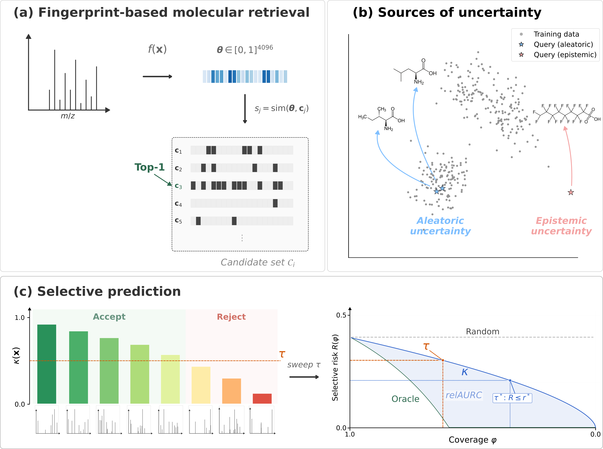

# Selective-MSMS

Code and data for **"When Should We Trust the Annotation? Selective Prediction for Molecular Structure Retrieval from Mass Spectra"**.

When do we know if an annotation of an MS/MS mass spectrum is correct with high probability?
This project studies how an MS/MS retrieval model can make that distinction: return confident molecular annotations and defer uncertain ones for further review.

- **Paper:** [arXiv:2603.10950](https://arxiv.org/abs/2603.10950)
- **Data and models:** [10.5281/zenodo.19108280](https://doi.org/10.5281/zenodo.19108280)

## Overview

<p align="center">
  
</p>

## Quick Start

The paper environment is in `environment.lock.yml`:

```bash
conda env create -f environment.lock.yml
conda activate selective_msms
pip install -e .
```

A CPU is enough to browse and validate the released results. Prediction generation and candidate rescoring are happier on a GPU.

## Pick Your Route

| Goal | What you need |
|---|---|
| Browse the paper results | `results.zip` |
| Regenerate model predictions | `checkpoints.zip` and MassSpecGym |
| Rerun the full evaluation | Everything above plus the candidate helpers |
| Train a new ensemble | MassSpecGym and the training scripts |

The Zenodo files extract directly into `data/`:

```bash
unzip results.zip
unzip checkpoints.zip
```

## Reproduce results from the paper

When using `results.zip` , no MassSpecGym download or GPU is needed:

```bash
python scripts/evaluate.py validate --data data
python scripts/evaluate.py report --data data --output outputs/report
```

Open `outputs/report/index.html` for the figures and tables.

To regenerate the seven prediction tensors from the released checkpoints:

```bash
python scripts/evaluate.py predict \
  --data data \
  --massspecgym-data /path/to/massspecgym-data \
  --device cuda:0
```

Predictions are about 18 GB. MC Dropout and Laplace samples can vary slightly across systems, the exact paper scores are in `results.zip`.

For the full candidate rescoring and analysis:

```bash
python scripts/evaluate.py full \
  --data data \
  --massspecgym-data /path/to/massspecgym-data \
  --output outputs/evaluation \
  --device cuda:0
```


## MassSpecGym Data

The experiments use **MassSpecGym v1**, not v1.5. Download the spectrum table and the official formula/mass candidate lists from [MassSpecGym on Hugging Face](https://huggingface.co/datasets/roman-bushuiev/MassSpecGym/tree/main/data):

```bash
python -m pip install huggingface_hub
hf download roman-bushuiev/MassSpecGym \
  data/MassSpecGym.tsv \
  data/molecules/MassSpecGym_retrieval_candidates_formula.json \
  data/molecules/MassSpecGym_retrieval_candidates_mass.json \
  --repo-type dataset \
  --local-dir /path/to/massspecgym-download
```

Copy or symlink those three files into one working directory. The models also use cached 4096-bit Morgan fingerprints and 2D InChIKeys. Generate them with the [`ms-mole` preprocessing utility](https://github.com/gdewael/ms-mole#reproduction-steps), using its `inchi` and `morgan_2_4096` commands.

The full list of expected filenames, sizes, hashes, and source notes lives in [`EXTERNAL_DATA.tsv`](EXTERNAL_DATA.tsv). In short, the working directory contains:

- `MassSpecGym.tsv`;
- the formula and mass candidate `.json` files;
- `fp_4096.npy` and `inchis.npy`;
- matching `_fps.npz` and `_inchi.npz` helpers.

The uncapped appendix experiment additionally uses `massspecgym_118m_mira.json`. Once that mapping is available, build its test helpers with:

```bash
python scripts/prepare_uncapped_candidates.py \
  --source_json /path/to/massspecgym-data/massspecgym_118m_mira.json \
  --dataset_tsv /path/to/massspecgym-data/MassSpecGym.tsv \
  --output_dir /path/to/massspecgym-data \
  --fold test
```


## Training

Train the formula-candidate MLP ensemble with:

```bash
python scripts/train_ensemble.py \
  /path/to/MassSpecGym.tsv \
  /path/to/candidate-files \
  outputs/training \
  --method ensemble \
  --n_members 5 \
  --architecture mlp \
  --candidate_setting formula \
  --rankwise_loss bienc \
  --rankwise_temp 0.003 \
  --devices "[0,1,2,3,4]" \
  --max_parallel 5
```

Use `--candidate_setting mass --label_mode inchikey` for the mass-trained ensemble. `scripts/train.py` trains one model; `scripts/train_ensemble.py` launches the members.

## Repository Map

```text
config/paper.yml                       Paper settings
ms_uq/                                 Models and evaluation code
scripts/evaluate.py                    Reproduce the paper results
scripts/train.py                       Train one model
scripts/train_ensemble.py              Train an ensemble
scripts/prepare_uncapped_candidates.py Build uncapped formula helpers
tests/                                 Regression tests
```


## Acknowledgements

The model architecture, dataset pipeline, and ranking loss build on [ms-mole](https://github.com/gdewael/ms-mole) and ["Small molecule retrieval from tandem mass spectrometry: what are we optimizing for?"](https://arxiv.org/abs/2602.16507) by De Waele et al.

This work uses the [MassSpecGym](https://github.com/pluskal-lab/MassSpecGym) benchmark by Bushuiev et al.

## Citation

```bibtex
@article{jurgens2026should,
  title   = {When Should We Trust the Annotation? Selective Prediction for Molecular Structure Retrieval from Mass Spectra},
  author  = {J{\"u}rgens, Mira and De Waele, Gaetan and Rakhshaninejad, Morteza and Waegeman, Willem},
  journal = {arXiv preprint arXiv:2603.10950},
  year    = {2026}
}
```

## License

MIT License. See [LICENSE](LICENSE).
